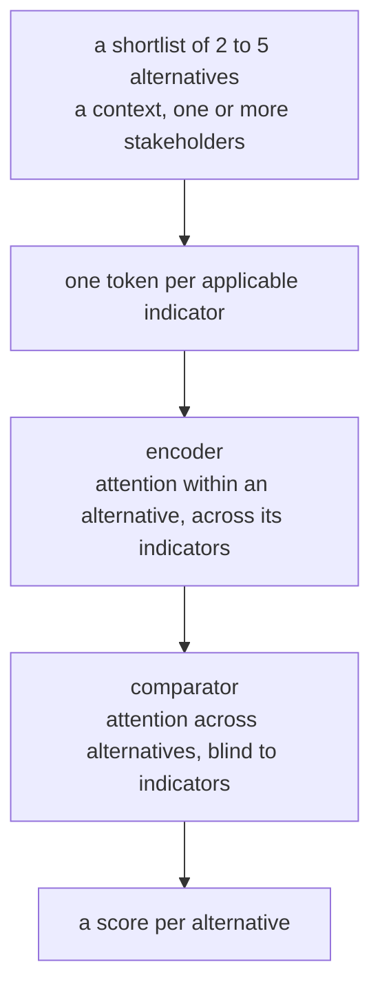
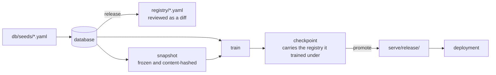

# Context-adaptive product recommender

Scores product alternatives against each other, given who is choosing and what
they are choosing it for.

You supply a shortlist, say which stakeholder priorities apply and which
application context the product is going into, and the model returns a
preference score per alternative. Scores are relative: they order the shortlist,
and they sit higher or lower as a group according to how good the shortlist is
overall.

## What it is for

The system is category-general. A product category is a set of rows in a
registry. Adding one means adding rows and data, with the schema, the model and
the scripts left alone. The working boundary is any product with an
environmental product declaration behind it, which today means mostly
construction, while the architecture stays agnostic about that.

One category is implemented. It serves as the validation case, chosen because an
open labelled dataset and a published result already exist for it. The whole
stack is built on that one so the next category becomes a configuration
exercise.

## How it works

### One scoring call



The comparator never sees an indicator, so comparing two concretes and comparing
two facade systems are the same operation. That is where transfer between
categories comes from.

Each token carries:

| | |
|---|---|
| identity | its family's embedding plus the indicator's own |
| value | against the declared range, and against the others on the table |
| state | present, relevant in this context |
| context | which way this context pulls it, and how hard |

Adding an indicator adds a token, which is why nothing else moves. A category
without the indicator has no token; a product missing the value has a token
saying so.

### What is fixed and what is learned

| Declared in the registry | Learned from data |
|---|---|
| what an indicator means and which way is better | a family embedding, and each indicator's own on top of it |
| the range each is measured against, per category | a level embedding for each rung of an ordered scale |
| the positions of an ordered scale's levels | a residual per context, on top of its declarations |
| which indicators a category holds | an embedding per stakeholder archetype |
| what each context pulls on, and how hard | the encoder, comparator and scoring head |

The learned parts are zero-initialised, so a new indicator starts as its family
and a new context starts as exactly its declarations.

### Where the registry travels



The weights record the snapshot hash and the registry version, so a result
traces back to what produced it. The deployment needs no database.

**Training targets the ordering and the gaps.** The distance between two options
is what someone acts on, so the loss penalises a wrong gap as well as a wrong
order. Every decision weighs the same whatever its size, and near-ties are
treated as near-ties.

**Evaluation has a tier that is pass or fail.** Control cases generated from the
registry have a known answer, so they double as a test suite: the score moves
the way the registry says it should, and inverts when two contexts disagree.
Metrics say how close the model is. These say whether it learned the right
thing.

## Layout

```
registry/   the registry exported as readable files, so semantic changes diff
db/         the database: schema, migrations, seed data, integrity checks
ingest/     adapters for outside datasets; the control-case generator
snapshot/   database to frozen, hashed training data
core/       registry loading and token encoding, the shared vocabulary
model/      tokens, encoder, comparator, scoring head, loss, checkpoints
train/      training loop and run configurations
eval/       metrics, the behavioural suite, reporting and the release gate
serve/      inference API and the explorer
tests/      including the test that keeps the two encoding paths honest
```

Category names stay out of `model/`, `core/` and `train/`. A test fails if one
appears.

## Running it

Install, then build the database and load the registry:

```bash
pip install -r requirements-dev.txt

python -m alembic upgrade head                 # create the schema
python -m db.seed                              # load the registry from db/seeds
python -m db.validate                          # check it holds together
python -m db.release 0.1.0 --notes "initial"   # freeze and export it
```

Bring in a dataset, assign folds, and freeze a snapshot:

```bash
python -m ingest.adapters.concrete_v1 <scenarios.json> <labels.json>
python -m ingest.split
python -m snapshot.build 0.1.0
```

Generate control cases for any indicator the registry declares sweepable and the
data never varies on its own:

```bash
python -m ingest.generators.run <category> --only-uncovered --dry-run
python -m ingest.generators.run <category> --indicator <key> --count 1200
```

Train, evaluate and gate in one go:

```bash
python -m train.run --config train/configs/default.yaml
```

A config that names no `registry_version` trains under the newest release and
records which one that was. Pin one to reproduce an earlier run.

That writes a run directory holding the config used, the epoch history, the
metrics, the behavioural results and the checkpoint. Re-evaluate an existing
checkpoint without retraining:

```bash
python -m eval.run runs/<run>/model.pt --device cuda
```

A registry change that touches no model input (a level renamed, a definition
rewritten) reaches a deployed model only by swapping the blob the checkpoint
carries. The tool refuses if anything else moved:

```bash
python -m model.restamp serve/release/model.pt 0.2.1
```

Tests:

```bash
python -m pytest tests
```

The suite runs from a clean checkout. Every test builds its own registry from
`db/seeds/`, and the checks on what ships read the committed checkpoint. CI runs
it on Python 3.12, the version the deployment uses.

`tests/fixtures/snapshot/` holds the test fold, 1.8 MB of parquet. The shipped
checkpoint is scored against it and compared with the metrics recorded at
promotion, which `serve.release.promote` keeps in step. Training needs the
corpus and stays outside CI.

After a deliberate change to the API surface, re-record the committed schema:

```bash
RECOMMENDER_UPDATE_CONTRACT=1 python -m pytest tests/test_api_contract.py
```

Most commands accept `--db` for a database elsewhere, or set `RECOMMENDER_DB`.
Training picks up a CUDA device automatically when one is available.

## Serving

A run becomes servable by promoting it, which copies the checkpoint and a small
SHAP reference sample into `serve/release` along with a manifest recording the
run, the registry version, the snapshot hash and the evaluation:

```bash
python -m serve.release runs/<run> --db data/corpus.db --notes "why this one"
```

Promotion refuses a run that failed the behavioural gate or that has no
evaluation on record. Use `--force` to override, and say why in the notes.

Then:

```bash
uvicorn serve.api:app
```

The service reads `serve/release` by default, so a deployment carries everything
it needs and touches no database. Point it elsewhere with
`RECOMMENDER_CHECKPOINT` and `RECOMMENDER_DB`.

| Route | Purpose |
|---|---|
| `GET /explore/` | The comparison tool |
| `POST /score` | Score a shortlist under a context and stakeholders |
| `POST /explore/explain` | SHAP contributions for one alternative |
| `GET /categories` | What can be compared and what each category assumes |
| `GET /categories/{key}/indicators` | Definitions, ranges, units, levels |
| `GET /stakeholders` | The archetypes and what each prioritises |

Every response from `/score` echoes the category's declared eligibility
precondition, so a score stays distinguishable from a compliance statement.

## The comparison tool

`GET /explore/` is a page for scoring a real shortlist. Enter the indicator
values for each candidate, choose the context and whose priorities apply, and
read the ranking. Leaving a field blank states that the value is unknown, which
the model treats as a distinct input.

The form is generated from the registry, so a category becomes usable as soon as
its rows exist. Ordered scales appear as dropdowns, units and valid ranges come
from the declarations, and a level marked never-selectable is labelled as such.

Pressing **Why** on a result runs SHAP over that alternative, with the rest of
the shortlist held fixed, since the score is relative to what it is being
compared against. Contributions are per indicator, with a sentinel for unknown
so a missing value is something the explanation can attribute.

Three further endpoints under `/explore/` produce the sweeps used for figures:
`response`, `context-sensitivity` and `stakeholder-sensitivity`. They return
JSON and have no page of their own.

## Deploying

The repository carries everything a deployment needs, which is the application,
`serve/release`, and `requirements.txt`. `requirements.txt` is deliberately the
serving set alone and pins the CPU build of PyTorch; `requirements-dev.txt` adds
what training and data building require.

Scoring is about 10 ms and one explanation is a few seconds, on one CPU, in
under 1 GB of memory. No GPU and no database server.

- **Serverless.** `api/index.py` and `vercel.json` are ready for Vercel.
- **Container.** The `Dockerfile` builds a serving image that listens on `PORT`,
  defaulting to 7860 for platforms that expect it.

### Limits on a public deployment

The endpoints that run the model are rate limited per caller, so a crawler or a
hot loop cannot spend an unbounded amount of compute. The page, the form and the
registry listings stay open, so the tool still loads once scoring is refused. A
refused call returns 429 with `Retry-After`.

| Variable | Default | Meaning |
|---|---|---|
| `RECOMMENDER_RATE_LIMIT` | 10 | Scoring calls per caller per window |
| `RECOMMENDER_RATE_LIMIT_TOTAL` | 40 | Scoring calls per window across all callers |
| `RECOMMENDER_RATE_WINDOW` | 60 | Window length in seconds |

The window lives in the serving process. One container holds one window, so the
totals above are exact. A serverless host gives each instance its own, which
multiplies the ceiling by the instances alive.

The page scores on a button press and never on typing, so one reading of a
shortlist is one call. Ten a minute is a person working quickly; a script hits
it in a second.

Zero on both limits lifts the gate, which is what a local run or a batch script
wants.

A shortlist is capped at five alternatives, which is the widest set in the
training corpus. The comparator handles any number, so the cap is about staying
inside what the evaluation covers.

The counters live in the process. A serverless platform runs several instances
and recycles them, so the effective ceiling is a multiple of these numbers. They
bound what one caller can provoke; the platform's own spend limit is what
guarantees a bill.

`docs/STACK.md` records what every piece costs, with measured numbers.

## Adding a category

1. Write a seed file describing it: what it is measured per, which indicators
   apply, the declared range for each, whether a control case may sweep each one,
   and what regulatory filtering it assumes has already happened. Add rows for
   any indicator it needs that does not exist yet, with its definition and which
   way is better.
2. Seed, validate, and cut a new registry version.
3. Bring in its data through an adapter, or generate control cases from the
   registry.
4. Retrain across all categories together. Transfer is meant to run both ways,
   and the evaluation gates catch it if adding one category damages another.

No step involves writing model code. If one appears, treat it as a bug in the
design.

## Status

The stack runs end to end on one category, with the behavioural gate passing.
Outstanding:

- **Gate thresholds.** The behavioural tier gates today. The numeric pass marks
  for gap fidelity and band placement stay unset until there is a reason to
  choose particular values.
- **The reproduction result.** Matching the published baseline under this
  architecture is the experiment that establishes the generalisation, and it has
  yet to be run.
- **A second category.** It amounts to data and rows, and stays unproven until
  it has been done once.
- **Reading values off a product declaration.** Values are entered by hand
  today. Extracting them from a document is a later step.

## Background

The first category's dataset and the earlier single-category model it is
validated against are both published:

- Dataset: <https://doi.org/10.34810/DATA3164>
- Paper: <https://doi.org/10.1016/j.spc.2026.06.011>

This repository supersedes that implementation. It reuses the data and the
problem definition, and reproducing the published results under the general
architecture is the check that the generalisation holds.
