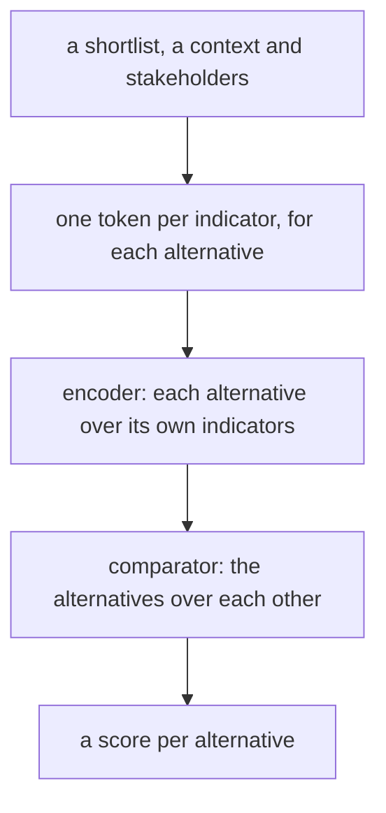
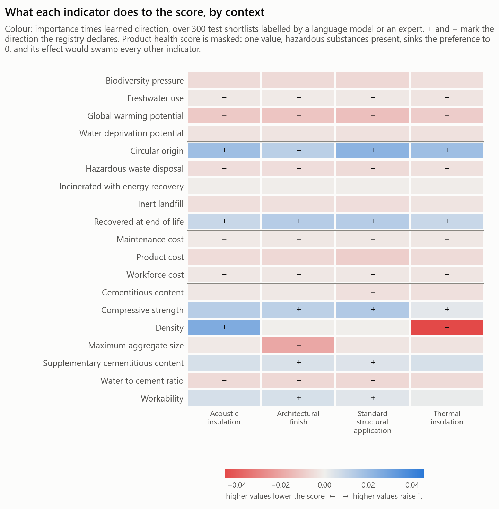
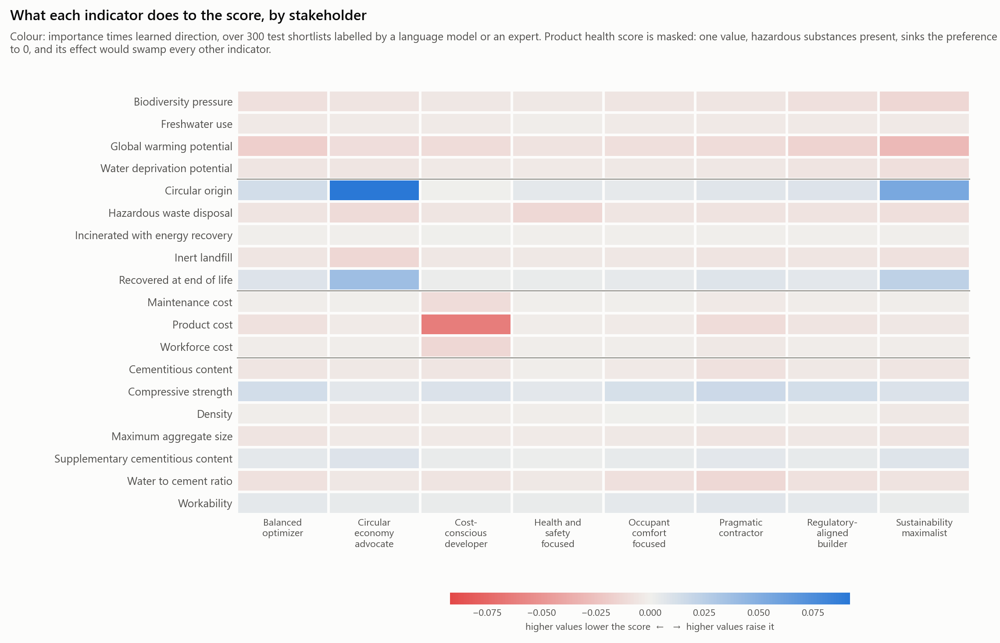

# Context-adaptive product recommender

A neural model that ranks a shortlist of building products for one decision.
Give it two to five candidates, the application they are for and whose
priorities count; it returns a score between 0 and 1 for each.

**Live at <https://context-adaptive-product-recommende.vercel.app>.**

Concrete is the first product category. Further categories are meant to be
added as data, with the model code left untouched.

## The problem

What counts as a good product depends on two things a fixed weighting cannot
capture:

- **The application.** A dense concrete suits an acoustic wall; a light one
  suits thermal insulation. The same indicator points in opposite directions.
- **The decision-maker.** A cost-conscious developer and a circular-economy
  advocate rank the same options differently.

The recommender scores every shortlist under a stated context and set of
stakeholders. A score orders the options within the shortlist and places the
shortlist as a whole on a quality band, so the best of three poor options
still scores low. Every option is assumed to have passed the regulatory checks
for its use; the model ranks compliant options.

## How it works



A **registry** declares what the model knows: the categories, their
indicators (carbon, cost, circularity, health, technical performance), the
application contexts and the stakeholder archetypes, with directions and
reference ranges. The model learns only what the registry leaves open. An
unknown value is an input in its own right and is never guessed.

The comparator never sees an indicator, so comparing two concretes and two
facade systems is the same operation. That shared stage is where learning can
carry over between categories.

Training data comes from three sources: control cases generated from the
registry, shortlists scored by a language model, and shortlists scored by
experts.

## Results

<!-- results:start -->
The model in `serve/release/` comes from run `baseline-20260921T125233Z` and
carries registry 0.2.1. On 8,231 test shortlists it scores:

| Gap fidelity | Band placement | Top-1 agreement | Tie-tolerant rank correlation | Behavioural assertions |
|---|---|---|---|---|
| 0.048 | 0.018 | 0.905 | 0.909 | 456 of 456 pass |
<!-- results:end -->

The behavioural assertions check that the model responds to each indicator in
the direction the registry declares, in every context and for every
stakeholder.

Which indicators drive the scores, by context and by stakeholder:





## Using it

The [comparison page](https://context-adaptive-product-recommende.vercel.app)
scores a shortlist entered by hand and says what each option wins on. The
address holds the whole comparison, so it can be shared as a link.

The API is served from the same address under `/api`, documented at
[`/api/docs`](https://context-adaptive-product-recommende.vercel.app/api/docs):

```bash
curl -X POST https://context-adaptive-product-recommende.vercel.app/api/score \
  -H "Content-Type: application/json" \
  -d '{"category": "concrete", "context": ["acoustic_insulation"],
       "alternatives": [{"id": "a", "values": {"gwp": 0.18, "density": 2400}},
                        {"id": "b", "values": {"gwp": 0.12, "density": 1900}}]}'
```

## Running locally

```bash
pip install -r requirements.txt
(cd frontend && npm ci && npm run build)
uvicorn app:app
```

## Rebuilding from source

```bash
pip install -r requirements-dev.txt

python -m alembic upgrade head          # the registry
python -m db.seed && python -m db.validate
python -m db.release 0.1.0

python -m ingest.adapters.concrete_v1 <scenarios.json> <labels.json>   # the data
python -m ingest.split
python -m snapshot.build 0.1.0

python -m train.run --config train/configs/default.yaml   # train and evaluate
python -m serve.release runs/<run>                         # promote to serve/release/
```

Torch trains the model; the service runs an ONNX export of it, written on
promotion.

## Tests

```bash
python -m pytest tests
(cd frontend && npm test)
```

## Releasing

Pushes to `main` run CI and deploy nothing. The live site follows the
`production` branch:

```bash
git switch main && git pull && git push origin main:production
```

## Repository layout

```
registry/      readable export of the current registry
db/            schema, seeds and release tooling
ingest/        dataset adapters and the control-case generator
snapshot/      frozen training snapshots
core/          registry loading and encoding, shared by training and serving
model/         the network, loss, checkpoints and ONNX export
train/, eval/  training, metrics and the release gate
serve/         the API and the shipped release
frontend/      the comparison page
experiments/   offline analyses
tests/         the test suite
```

## Adding a category

Write its registry rows, bring in data or generate control cases, and retrain
on all categories together. None of it involves model code; if it ever does,
that is a flaw in the design.

## Status

Still open: reproducing the published single-category result under this
architecture, adding a second category, and reading values from environmental
product declarations.

## Background

The concrete dataset and the earlier single-category model are published:

- Dataset: <https://doi.org/10.34810/DATA3164>
- Paper: <https://doi.org/10.1016/j.spc.2026.06.011>
