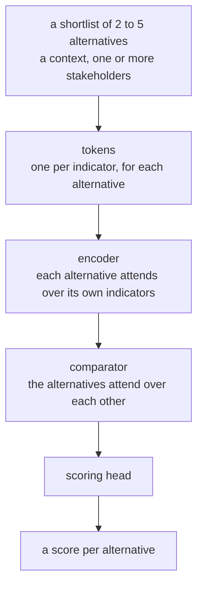
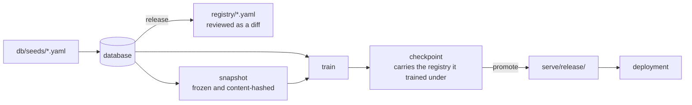

# Context-adaptive product recommender

A neural model that ranks a shortlist of building products for one specific
decision. You give it two to five candidate products, the application they are
for, and whose priorities count. It returns a score between 0 and 1 for each
candidate.

Concrete is the first product category. The design goal is that further
categories, such as facade systems, foundations or taps, are added as data in a
registry, with the model code left untouched.

## The problem

Choosing a building product means weighing many indicators at once: carbon,
water, cost, recycled content, end-of-life routes, health certification and
technical performance. A single fixed weighting of those indicators fails for
two reasons.

**The application changes what counts as good.** A dense concrete blocks sound,
so it suits an acoustic wall. A light concrete insulates better, so it suits a
thermal application. The same indicator, density, points in opposite
directions depending on where the product goes.

**The decision-maker changes the trade-off.** A cost-conscious developer and a
circular-economy advocate looking at the same three mixes will reasonably rank
them differently.

The recommender takes both into account. Every score it produces belongs to one
shortlist, one application context and one set of stakeholders.

## Reading a score

A score does two jobs.

- **Order within the shortlist.** A higher score is a better option, and the
  size of the gap says by how much. A gap of 0.02 is a near-tie. A gap of 0.30
  is a clear preference.
- **Band for the shortlist as a whole.** A shortlist of good options sits high
  and a shortlist of poor options sits low. The best of three poor mixes still
  receives a weak score.

So a score of 0.6 means 0.6 against these alternatives, in this context, for
these stakeholders. A score is always read against its own shortlist.

Every alternative is assumed to have already passed the regulatory checks for
its use; for concrete, that means the exposure class rules. The model ranks the
compliant options. Each API response repeats this assumption, so a score cannot
be mistaken for a compliance statement.

## Vocabulary

| Term | Meaning | Example from the concrete category |
|---|---|---|
| Category | A kind of product, compared per a common functional unit | Concrete, per kilogram |
| Indicator | One measured or declared property of a product | Global warming potential, product cost, density |
| Family | A group of related indicators | Environmental impact, cost, circularity, health and safety, technical performance |
| Context | The application the product is going into | Standard structural, acoustic insulation, thermal insulation, architectural finish |
| Stakeholder | An archetype of decision-maker with stated priorities | Cost-conscious developer, sustainability maximalist, pragmatic contractor |
| Shortlist | The two to five alternatives being compared | Three candidate mixes from different suppliers |
| Registry | The database that defines all of the above | Edited in `db/seeds/`, readable in `registry/` |

The concrete category holds 21 indicators in 5 families, 4 contexts and 8
stakeholder archetypes. Their full written definitions are in `registry/`.

## The registry

The model reads everything it knows about indicators, contexts and categories
from the registry.

For each **indicator**, the registry records a written definition, a unit and a
default direction: higher is better, lower is better, or neutral. For each
category that uses the indicator, it also records a reference range (for
example, 0.05 to 0.5 kg CO2-eq per kilogram for global warming potential in
concrete), whether the range is linear or logarithmic, and whether the
indicator always counts or only counts when a context asks for it. Ordered
scales, such as the health certification levels, record the position of each
level.

For each **context**, the registry records which indicators it pulls on, in
which direction and how strongly. Acoustic insulation pulls density upwards
with priority 0.9. Thermal insulation pulls it downwards with the same
priority. Environmental, cost, circularity and health indicators count in every
context; technical performance indicators count only where a context declares
them.

For each **stakeholder**, the registry records a written description, a
priority per family and, for some indicators, a priority of their own. The
generator uses those priorities when it produces control cases; the model
learns an embedding per stakeholder from the training data.

The registry is authored as YAML in `db/seeds/`, loaded into a SQLite database,
checked for consistency, and released under a version number. Each release
writes a readable copy to `registry/`, so any change of meaning shows up as a
reviewable diff. A test fails if that copy drifts from the seeds.

## How the model works



### Tokens

Each alternative becomes a set of tokens, one for every indicator the category
holds. A token combines six things:

| Part | Content |
|---|---|
| Identity | A learned embedding for the indicator's family, plus one for the indicator itself |
| Level | For an ordered scale, a learned embedding for the level |
| Value against the range | The value placed on the registry's reference range and clipped to 0 to 1, with a flag when clipping happened |
| Value against the shortlist | Where the value sits among the other alternatives |
| State | Whether the value is known, and whether the indicator counts in this context |
| Pull | The direction and strength the active context applies, and the distance to an ideal value where one is declared |

An unknown value still produces a token, marked as unknown. The model treats
"unknown" as an input in its own right and never fills in a guess. An indicator
that a category lacks produces no token at all. Adding an indicator to the
registry therefore adds a token, and every existing weight keeps its meaning.

### Encoder

Self-attention over one alternative's tokens, pooled into a single vector for
that alternative. The pooling is conditioned on the category, the contexts and
the stakeholders, so the same product can be summarised differently depending
on the question being asked.

### Comparator

Self-attention across the alternative vectors, so each alternative is judged
against its competitors. The comparator receives only those vectors and the
conditioning. Indicators never reach it, which makes comparing two concretes
and comparing two facade systems the same operation. This shared stage is where
what the model learns in one category can carry over to another. A test fails
if an indicator ever reaches it.

### Scoring head

A small network that sees three inputs: the alternative after comparison, a
summary of the whole shortlist, and the conditioning. The shortlist summary
sets the band. The alternative sets its place within that band.

The whole model has about 590,000 parameters, and the shipped checkpoint is
2.4 MB.

### Declared and learned

The registry supplies meaning. Training supplies what the registry leaves open.

| Declared in the registry | Learned from data |
|---|---|
| What each indicator means and which way is better | An embedding per indicator family, and a per-indicator adjustment on top |
| The reference range for each indicator, per category | An embedding per level of an ordered scale |
| The positions of an ordered scale's levels | A per-context adjustment on top of its declarations |
| Which indicators a category holds | An embedding per stakeholder archetype |
| What each context pulls on, and how hard | The encoder, comparator and scoring head |

The per-indicator, per-level and per-context embeddings start at zero. A newly
added indicator therefore starts out behaving like the rest of its family, and
a newly added context starts out as exactly what its declarations say. The
per-context adjustment is there to capture effects the declarations miss.

The embedding tables are sized from the registry. Adding a row appends to a
table, and a checkpoint trained under an older registry loads into a newer,
larger one.

## Training data

Each training example is a shortlist with a target score for every
alternative. Examples come from three sources, recorded as their provenance.

| Provenance | Source | Role |
|---|---|---|
| Control | Generated from the registry. Every indicator is held at its ideal value except one, which is swept across its range. | Teaches each declared direction cleanly. Doubles as a test suite. |
| LLM | Scored by a language model against a written brief, with a self-reported confidence | Broad coverage of realistic trade-offs |
| Expert | Scored by a domain practitioner | Few and slow to obtain. The closest available thing to ground truth. |

For concrete, the control and LLM sets number in the tens of thousands and the
expert sets in the hundreds. The registry gives each provenance a share of the
training signal: currently 0.4 for control, 0.4 for LLM and 0.2 for expert. The
share applies to each provenance as a group. The few hundred expert sets
together carry a fifth of the signal, which makes each expert judgement count
far more than any single generated case.

The loss has two terms.

- A **pointwise** term puts each score in the right band. It is weighted by the
  confidence attached to the label.
- A **pairwise** term covers every pair within a shortlist and penalises a
  wrong gap as well as a wrong order.

Every shortlist carries equal weight, whatever its size. Near-ties stay
near-ties: when the labels put two products at 0.87 and 0.88, the loss applies
no pressure to push them apart.

## Evaluation

Evaluation has two tiers.

**Metrics** measure how close the model is on the held-out test fold.

| Metric | Question | Better when |
|---|---|---|
| Gap fidelity | Are the differences between alternatives right? Mean absolute error of the gaps within each shortlist. | Lower |
| Band placement | Does the shortlist land at the right height? Mean absolute error of each shortlist's mean score. | Lower |
| Top-1 agreement | Does the model's first choice match the label's first choice? | Higher |
| Tie-tolerant rank correlation | A Kendall-style correlation that excuses pairs the label puts within 0.03 of each other | Higher |

**Behavioural assertions** check that the model learned the right thing. They
are generated from the registry and each one passes or fails.

- **Monotonicity.** Sweep one indicator with everything else held at its ideal.
  The score must move in the direction the registry declares, under every
  context and for every stakeholder.
- **Sign flip.** Where two contexts declare opposite directions for the same
  indicator, the response must invert between them. Acoustic and thermal
  insulation over density is the current case.
- **Disqualification.** A level the registry marks as never selectable must
  score below the alternatives around it.

When the score barely moves across a sweep, the assertion is reported as
`no_response` and kept apart from the failures. That result usually means the
training data never varied the indicator on its own, and the remedy is more
control cases. An indicator whose declared direction is only safe over part of
its range is marked `exclude` in the registry and left out of the suite, with
the reason recorded beside it.

<!-- results:start -->
The model in `serve/release/` comes from run `baseline-20260921T125233Z` and
carries registry 0.2.1. On 8,231 test shortlists it scores:

| Gap fidelity | Band placement | Top-1 agreement | Tie-tolerant rank correlation | Behavioural assertions |
|---|---|---|---|---|
| 0.048 | 0.018 | 0.905 | 0.909 | 456 of 456 pass |
<!-- results:end -->

Promotion writes this table from the release. The full record, broken down by
provenance, family and shortlist size, is in `serve/release/metrics.json`. CI
re-scores the shipped checkpoint on every push and fails if the result drifts
from that record, or if this table disagrees with it.

## What drives the scores

`experiments/attribution.py` measures which indicators the shipped model
relies on. For each shortlist it withholds one indicator from every
alternative, scores the shortlist again, and records how far each score moved.
Withholding a value is a state the model was trained on, so the measurement
never feeds it an invented number.

```bash
python -m experiments.attribution
```

It reads the committed test fold, samples 300 shortlists labelled by a language
model or an expert, and writes four figures with the tables behind them to
`runs/analysis/`. Each shortlist is re-scored under every context and then for
every stakeholder, with everything else kept as recorded.

| Figure | What it shows |
|---|---|
| `by-context` | Each indicator's effect under each context. Colour combines importance with the learned direction; `+` and `−` mark what the registry declares. Density should flip between acoustic and thermal insulation. |
| `by-stakeholder` | The same for each stakeholder archetype. A cost-conscious developer should lean on cost, a circular-economy advocate on circularity. |
| `family-share` | The share of the total effect each indicator family accounts for, per context and per stakeholder. |
| `shap-agreement` | Withholding against SHAP for 30 alternatives, as a check on the method. |

The figures mask any indicator with a veto value: one value that sinks the
preference to 0 on its own. The script finds these in the control cases, where
every other indicator sits at its ideal. For concrete that is the health score,
whose lowest level (hazardous substances present) scores 0 while every other
indicator's worst value still scores above 0.4. Left in, its effect is about
half of the total and hides everything else. Each caption names what was
masked and why, and the CSV tables keep the masked rows.

`--sets`, `--shap` and `--seed` change the sample, and `--shap 0` skips the
slow SHAP step. The full run takes about three minutes on a CPU.

## From registry to deployment



A snapshot is a frozen, hashed export of the training data. The checkpoint
stores the snapshot hash, the registry version and a full copy of the registry,
so any score traces back to the data and definitions that produced it. The
deployment reads everything from `serve/release/` and needs no database.

## Repository layout

```
registry/      readable export of the current registry release
db/            schema, migrations, seed files, validation and release tooling
ingest/        adapters for outside datasets, fold assignment, control-case generator
snapshot/      freezes the database into hashed parquet files for training
core/          registry loading and token encoding, shared by training and serving
model/         tokens, encoder, comparator, scoring head, loss, checkpoints
train/         training loop and run configurations
eval/          metrics, behavioural assertions, reports and the release gate
serve/         the API, the comparison page, rate limits and the shipped release
experiments/   offline analyses: what drives the scores, and SHAP
tests/         the test suite, with its own small evaluation fixture
```

No category name may appear in `model/`, `core/` or `train/`. A test enforces
this.

## Quick start

The shipped model runs from a fresh clone with the serving dependencies alone:

```bash
pip install -r requirements.txt
uvicorn serve.api:app
```

Open <http://127.0.0.1:8000/> for the comparison page. Scoring is rate limited
by default; set `RECOMMENDER_RATE_LIMIT=0` and `RECOMMENDER_RATE_LIMIT_TOTAL=0`
to lift the limit for local work.

A scoring request looks like this:

```bash
curl -X POST http://127.0.0.1:8000/score \
  -H "Content-Type: application/json" \
  -d '{
    "category": "concrete",
    "context": ["acoustic_insulation"],
    "stakeholders": ["cost_conscious_developer"],
    "alternatives": [
      {"id": "mix-a", "values": {"gwp": 0.18, "cost_product": 0.09, "density": 2400}},
      {"id": "mix-b", "values": {"gwp": 0.12, "cost_product": 0.11, "density": 1900}}
    ]
  }'
```

Each result carries a score, a rank, the indicators left unknown and any
disqualifying levels. The response also echoes the functional unit, the
registry version, the model's snapshot hash and the eligibility assumption.
Indicator keys, units and ranges come from `GET /categories/concrete/indicators`.

## The comparison page

The page at `/explore/` is for scoring a real shortlist by hand. Pick a
category, a context and whose priorities apply, enter the indicator values for
each candidate, and press **Score**. A blank field means the value is unknown,
and the model treats it that way.

The form is built from the registry. Units and valid ranges come from the
declarations, ordered scales appear as dropdowns, and a never-selectable level
is labelled as such. A new category appears on the page as soon as its registry
rows exist.

Each result is annotated with what that alternative wins on. To find out, the
page asks `/explore/compare` to take the leading alternative, give it a rival's
value for one indicator at a time, and score it again. Indicators that change
the gap are the ones that matter to the result. Among those, an alternative is
credited with a win where it holds the best value in the direction the context
declares. Every figure comes from the real model; nothing is sampled.

## API

| Route | Purpose |
|---|---|
| `GET /` | Redirects to the comparison page |
| `GET /health` | The loaded registry version, snapshot and categories |
| `POST /score` | Score a shortlist under a context and stakeholders |
| `GET /categories` | The categories and the eligibility assumption of each |
| `GET /categories/{key}/indicators` | Definitions, units, ranges and levels |
| `GET /stakeholders` | The archetypes and what each prioritises |
| `GET /explore/` | The comparison page |
| `GET /explore/form` | Everything the page needs to draw its form |
| `POST /explore/compare` | Which indicators separate the leader from each rival |
| `GET /explore/response` | The score as one indicator sweeps its range |
| `POST /explore/context-sensitivity` | One shortlist scored under every available context |
| `POST /explore/stakeholder-sensitivity` | One shortlist scored for every stakeholder |

The last three produce the data behind figures and have no page of their own.
The committed OpenAPI schema lives in `tests/contracts/openapi.json`, and a test
fails when the live schema differs from it.

## Rebuilding from source

This section rebuilds the database, the training data and the model. It needs
the development dependencies:

```bash
pip install -r requirements-dev.txt
```

Every command below works on `data/corpus.db`. Set `RECOMMENDER_DB` to use
another file, or pass `--db` to a single command. These dependencies pin the
CPU build of PyTorch. For GPU training, install a CUDA
build of PyTorch afterwards; training uses a CUDA device automatically when one
is present.

**1. Build the registry.** Create the schema, load the seeds, check them and
cut a release:

```bash
python -m alembic upgrade head
python -m db.seed
python -m db.validate
python -m db.release 0.1.0 --notes "initial"
```

**2. Load the data.** Import the published concrete dataset (see
[Background](#background)), assign train, validation and test folds, and freeze
a snapshot under the registry release:

```bash
python -m ingest.adapters.concrete_v1 <scenarios.json> <labels.json>
python -m ingest.split
python -m snapshot.build 0.1.0
```

**3. Fill coverage gaps.** Generate control cases for any sweepable indicator
that the data never varies on its own. The first command lists what is
missing; the second generates cases for one indicator:

```bash
python -m ingest.generators.run concrete --only-uncovered --dry-run
python -m ingest.generators.run concrete --indicator <key> --count 1200
```

**4. Train.** One command trains, evaluates and applies the behavioural gate:

```bash
python -m train.run --config train/configs/default.yaml
```

The run directory under `runs/` holds the config used, the per-epoch history,
the metrics, the behavioural results and the checkpoint. A config that names no
`registry_version` trains under the newest release and records which one it
used; naming a version reproduces an earlier run. `train/configs/smoke.yaml` is
a short run for checking the pipeline.

To re-evaluate a checkpoint without retraining:

```bash
python -m eval.run runs/<run>/model.pt --device cuda
```

**5. Promote.** Copy a run into `serve/release/`:

```bash
python -m serve.release runs/<run> --notes "why this one"
```

Promotion writes a manifest recording the run, the registry version, the
snapshot hash and the evaluation. It also refreshes the test fixture in
`tests/fixtures/snapshot/`, which CI uses to re-score the shipped model.
Promotion refuses a run that failed the behavioural gate, that has no
evaluation on record, or that scores worse than the current release on any
stratum. `--force` overrides the refusal and records that it was forced; the
notes should say why.

**Registry edits that change no model input.** Renaming a level or rewriting a
definition leaves the weights valid. Stamp the new registry release into the
shipped checkpoint:

```bash
python -m model.restamp serve/release/model.pt 0.2.1
```

The tool refuses if anything the model reads has changed.

## Tests

```bash
python -m pytest tests
```

The suite runs from a clean checkout with no database and no corpus. Each test
builds its own registry from `db/seeds/`, and the checks on what ships read the
committed checkpoint and the 1.8 MB test fixture. CI runs pyflakes and the full
suite on Python 3.12, the version the deployment uses.

After a deliberate change to the API, record the new schema:

```bash
RECOMMENDER_UPDATE_CONTRACT=1 python -m pytest tests/test_api_contract.py
```

## Deploying

A deployment needs the application code, `serve/release/` and
`requirements.txt`. That file holds the serving dependencies alone and pins the
CPU build of PyTorch.

On one CPU, a scoring call takes about 10 ms, a comparison about 45 ms, and
the process holds about 650 MB of memory. It needs no GPU and no database server.

- **Vercel.** `app.py` and `vercel.json` are the whole configuration.
- **Container.** The `Dockerfile` builds a serving image that listens on
  `PORT`, 7860 by default, which suits Hugging Face Spaces.

The service reads `serve/release/` by default. `RECOMMENDER_CHECKPOINT` points
it at another checkpoint.

### Limits on a public deployment

The routes that run the model are rate limited per caller. The page, the form
and the registry listings stay open, so the page still loads when scoring is
refused. A refused call returns 429 with a `Retry-After` header.

| Variable | Default | Meaning |
|---|---|---|
| `RECOMMENDER_RATE_LIMIT` | 10 | Scoring calls per caller per window |
| `RECOMMENDER_RATE_LIMIT_TOTAL` | 40 | Scoring calls per window across all callers |
| `RECOMMENDER_RATE_WINDOW` | 60 | Window length in seconds |

The page scores on a button press, so one reading of a shortlist is one call.
Ten a minute suits a person working quickly and stops a script within seconds.
Setting both limits to zero lifts the gate.

The counters live in the serving process. In a single container the limits
hold exactly. A serverless host runs one counter per instance, so the real
ceiling is these numbers times the instances alive. The limits bound what one
caller can provoke; the hosting platform's spend limit is what caps the bill.

A shortlist is capped at five alternatives, the widest set in the training
data. The comparator itself accepts any number; the cap keeps requests inside
what the evaluation covers.

## Adding a category

1. Write a seed file for the category: its functional unit, which indicators
   apply, the reference range for each, whether control cases may sweep each
   one, and what regulatory filtering it assumes has already happened. Add any
   new indicators it needs, each with a definition and a direction.
2. Seed, validate and cut a new registry release.
3. Bring in data through an adapter, or generate control cases from the
   registry.
4. Retrain on all categories together. Learning is meant to transfer in both
   directions, and the evaluation gates catch a new category that harms an
   existing one.

None of these steps involves writing model code. If one ever does, that is a
flaw in the design and should be fixed there.

## Status

The full stack runs end to end on concrete, and the shipped model passes every
behavioural assertion. Still open:

- **Metric thresholds.** The behavioural tier gates promotion today. Pass marks
  for gap fidelity and band placement will be set once there is a principled
  basis for particular values.
- **Reproducing the published result.** Matching the earlier single-category
  model under this architecture is the experiment that shows the
  generalisation holds. It has yet to be run.
- **A second category.** It should need only registry rows and data. That
  claim stands unproven until it has been done once.
- **Reading values from product declarations.** Values are entered by hand
  today. Extracting them from an environmental product declaration is a later
  step.

## Background

The concrete dataset and the earlier single-category model are both published:

- Dataset: <https://doi.org/10.34810/DATA3164>
- Paper: <https://doi.org/10.1016/j.spc.2026.06.011>

This repository supersedes that implementation. It reuses the data and the
problem definition, and reproducing the published results under the
category-general architecture is the test of the generalisation.
